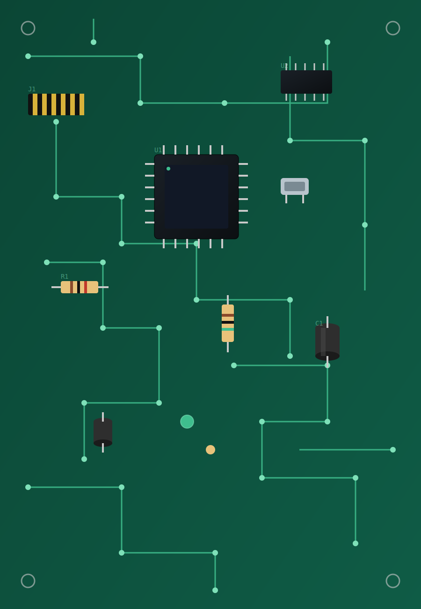

<p align="center">
  
</p>

<h1 align="center">ReCircuit</h1>
<p align="center"><b>Intelligent PCB Component Recovery & Reuse System</b></p>
<p align="center"><i>Smarter recovery, reuse, and circular design for electronics sustainability.</i></p>

<p align="center">
  
  
  
  
</p>

Built by **Team The InnoveRise** for **Automate India — NIET Chapter**.

---

## 📖 Overview

E-waste is growing 3–5% every year, yet most discarded PCBs go straight to
material recycling instead of component recovery — functional parts are
shredded along with the scrap, and manual recovery doesn't scale.

**ReCircuit** proposes an automated pipeline that turns discarded circuit
boards into tested, inventory-ready parts:

```
Scan → Identify → Decide → Recover → Validate → Passport → Inventory
```

This repository contains two things:

1. 🖥️ **A working interactive prototype** (`frontend/`) — open it in any
   browser, no install or internet needed, to walk through the full
   pipeline exactly as it was demoed.
2. 🐍 **A real backend implementation** (`backend/`) of the recovery
   decision rules and functional grading logic described in the pitch —
   runnable, unit-tested Python behind a small Flask API, backed by
   SQLite — proving the logic works, not just simulating it in the UI.

## 🖼️ Demo

Open [`frontend/index.html`](frontend/index.html) directly in a browser.

1. Click **🔍 Scan Discarded PCB** — the system "detects" 4 components on
   a sample board.
2. Click a component (R1, C1, D1, or U1) to select it for analysis.
3. Click **🎯 Evaluate Recovery** to see the recovery decision.
4. If recoverable, click **🤖 Simulate Extraction**, then **⚡ Validate**
   to generate a digital component passport and add it to the inventory
   table.

> **Note:** confidence scores and measurements in the frontend are
> demonstration data. The equivalent decision rules are implemented for
> real in [`backend/decision_engine.py`](backend/decision_engine.py) and
> covered by [tests](backend/tests/test_decision_engine.py).

## ⚙️ How It Works

1. **PCB Input** — a board enters the system
2. **Vision-Based Component Detection** — camera scans and maps components
3. **Intelligent Selection** — decision engine decides what's worth recovering
4. **Automated Extraction** — robotic arm removes selected components
5. **Electrical Functionality Testing** — each component is individually tested
6. **Classification & Grading** — components graded A, B, C, or rejected
7. **Digital Inventory Logging** — components catalogued and tracked

See [`docs/ARCHITECTURE.md`](docs/ARCHITECTURE.md) for a full diagram and a
breakdown of how the frontend demo and backend logic map onto each stage.

## ✨ What Makes ReCircuit Different

| Feature | Description |
|---|---|
| 📷 Vision-Based Detection | Automatically maps PCB components |
| 🧠 Intelligent Selection | Rule-based (and eventually ML) prioritization of the best parts to recover |
| 🦾 Automated Extraction | Robotics removes selected components precisely |
| 🔬 Individual Electrical Testing | Every component is tested before grading |
| ⭐ A/B/C Functional Grading | Tolerance-based, tested grading logic |
| 🗄️ Full Traceability | SQLite-backed inventory tracks every component |

## 🌍 Who Benefits

- ♻️ **E-Waste Recyclers** — turn waste streams into usable parts
- 🔧 **Repair & Refurbishment** — verified components for faster repairs
- 🧪 **Labs & Education** — low-cost sourcing for prototyping and learning
- 🌱 **Sustainable Electronics** — supports circular economy practices

## 🛠️ Tech Stack

- **Frontend:** HTML, CSS, vanilla JavaScript (no build step, no dependencies)
- **Backend:** Python 3, Flask, SQLite, pytest
- **Planned/future hardware layer:** Python · OpenCV · Machine Learning ·
  ESP32/Arduino · Embedded C/C++ · custom electrical testing circuits

## 📂 Repository Structure

```
ReCircuit/
├── frontend/            # Standalone interactive browser demo
│   ├── index.html
│   ├── css/style.css
│   ├── js/app.js
│   └── assets/
├── backend/              # Python decision engine + Flask API
│   ├── app.py
│   ├── decision_engine.py
│   ├── vision_stub.py
│   ├── database.py
│   ├── requirements.txt
│   ├── tests/
│   └── README.md
├── docs/
│   ├── ARCHITECTURE.md
│   └── API.md
├── data/
│   └── component_specs.csv
├── .github/workflows/backend-tests.yml
├── LICENSE
├── CONTRIBUTING.md
└── README.md
```

## 🚀 Getting Started

### Run the frontend demo (no setup)
Just open `frontend/index.html` in a browser.

### Backend Getting Started

```bash
cd backend
python -m venv .venv
source .venv/bin/activate   # Windows: .venv\Scripts\activate
pip install -r requirements.txt
python app.py
```

The API is now live at `http://localhost:5000` — try:
```bash
curl http://localhost:5000/api/health
```

Full endpoint reference: [`docs/API.md`](docs/API.md)

### Run backend tests
```bash
cd backend
python -m pytest tests/ -v
```

## 🗺️ Roadmap

- [ ] Connect the frontend to the backend API (with offline fallback retained)
- [ ] Replace the vision stub with a real OpenCV/ML detector
- [ ] Connect `validate_component()` to a real electrical test rig
- [ ] Add ESP32/Arduino firmware for the physical extraction arm
- [ ] Deploy a hosted demo

## 👥 Team — The InnoveRise

- Ayush Jha
- Priyanshi Bansal
- Krishna Agrawal
- Akshat Khare

## 📄 License

Released under the [MIT License](LICENSE).

## 🤝 Contributing

See [`CONTRIBUTING.md`](CONTRIBUTING.md).

---

<p align="center"><i>ReCircuit — Because every functional component deserves a second life.</i></p>
