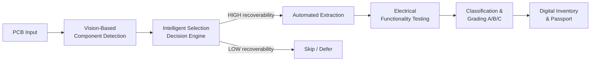

# Architecture

## Overview

ReCircuit models a closed-loop recovery pipeline for discarded PCBs. The
project currently exists at two levels:

1. **Frontend virtual prototype** (`frontend/`) — a self-contained,
   dependency-free HTML/CSS/JS simulation of the full workflow, used for
   demos and judging rounds. It requires no backend or internet connection.
2. **Backend logic layer** (`backend/`) — a real, tested Python
   implementation of the recovery decision rules and functional grading
   logic described in the pitch deck, exposed over a small Flask API and
   backed by SQLite. This is the part that would eventually be wired up to
   real computer-vision and electrical-testing hardware.

These two layers are currently independent (the frontend doesn't call the
backend) so the demo works offline. Wiring them together is the natural next
step — see [Roadmap](#roadmap).

## Pipeline stages



| Stage | Frontend (simulation) | Backend (real logic) |
|---|---|---|
| Scan | Hardcoded 4-part PCB illustration | `vision_stub.detect_components()` — placeholder for a real OpenCV/ML detector |
| Identify | Fixed confidence values per part | Same shape of data, ready to be replaced with live model output |
| Decide | `decide()` in `app.js` — recoverability flag from a lookup | `decision_engine.should_recover()` — real threshold + package-type rules |
| Recover | Animated "extraction" progress bar | Not yet implemented (would drive actual robotics/actuator control) |
| Validate | Canned measured values | `decision_engine.validate_component()` — tolerance-based grading against nominal component specs |
| Passport / Inventory | In-memory table row | Persisted to SQLite via `database.py`, queryable through `/api/inventory` |

## Why the logic is duplicated (for now)

The frontend prototype needs to run standalone, offline, in front of judges
with zero setup — so its decision logic is intentionally simple and
self-contained in JavaScript. The backend exists to prove the same rules as
real, tested, runnable Python that could sit behind actual hardware. Keeping
them separate for now was a deliberate scope decision for a first-year
prototype; see the roadmap below for unifying them.

## Repository layout

```
ReCircuit/
├── frontend/           # Standalone browser demo
│   ├── index.html
│   ├── css/style.css
│   ├── js/app.js
│   └── assets/
├── backend/             # Python decision/grading logic + API
│   ├── app.py            # Flask API
│   ├── decision_engine.py
│   ├── vision_stub.py
│   ├── database.py
│   ├── requirements.txt
│   └── tests/
├── docs/
│   ├── ARCHITECTURE.md
│   └── API.md
├── data/
├── README.md
├── LICENSE
└── CONTRIBUTING.md
```

## Roadmap

- [ ] Wire the frontend to call the backend API instead of simulating
      results locally (with an offline fallback mode retained for demos)
- [ ] Replace `vision_stub.py` with a real OpenCV/ML component detector
- [ ] Replace assumed measurements in `validate_component()` with live
      readings from an electrical test rig
- [ ] Add authentication + multi-user support to the inventory API
- [ ] Deploy the backend and serve the frontend from it as static files
